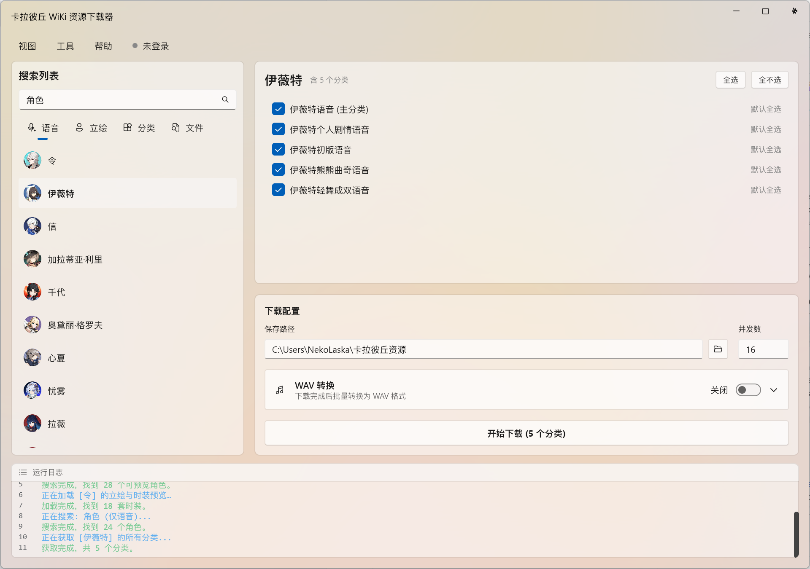
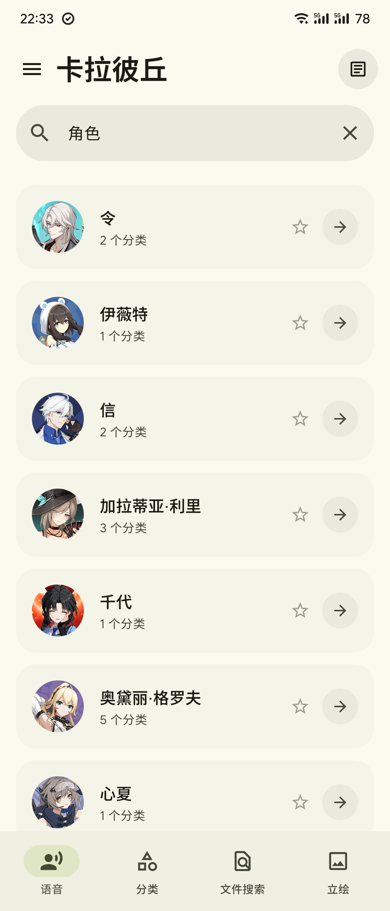

<div align="center">

# 🌌 CalabiYauVoice GUI


[](https://github.com/JetBrains/compose-multiplatform)

[](LICENSE.txt)

A Kotlin Multiplatform [Strinova](https://wiki.biligame.com/klbq/) Wiki resource browser & downloader, built with Compose for Desktop and Android.

[](https://wiki.nekolaska.vip/)
[](https://wiki.nekolaska.vip/search)

**Website:** [wiki.nekolaska.vip](https://wiki.nekolaska.vip/)  
**Backup:** [calabiyauwiki.pages.dev](https://calabiyauwiki.pages.dev/)

[简体中文](README_ZH_CN.md)

<br>

<table>
  <tr>
    <th>Desktop</th>
    <th>Android</th>
  </tr>
  <tr>
    <td></td>
    <td></td>
  </tr>
</table>

</div>

---

## ✨ Features

### 🤝 Shared (Both Platforms)

- **🔍 Smart Search** — 4 search modes: voice-only categories, all resource types, file search (namespace 6), and portrait/illustration.
- **⚡ Concurrent Downloads** — Scan category trees and download files with configurable concurrency.
- **🎵 Audio Playback** — In-app playback for `WAV`, `OGG`, `FLAC`, and `MP3` files.
- **🖼️ Rich Preview** — Live image previews for `PNG`, `JPG`, `WebP`, and animated `GIF`.
- **🗂️ File Selection Dialog** — Per-category file picker with search, language filtering (CN/JP/EN), and image preview.

### 🖥️ Desktop Extras (Windows)

- **🔄 MP3/FLAC → WAV Conversion** — Batch-convert downloaded audio to WAV with configurable sample rate and bit depth. Optional WAV merging.
- **⌨️ Keyboard Shortcuts** — `Ctrl+F` focus search, `F5` re-search, `Ctrl+D` download, `Ctrl+A` / `Ctrl+Shift+A` select / deselect all, `Ctrl+1~4` switch modes, `↑↓` navigate, and more.
- **🎛️ Windows Backdrop** — Switch between Mica, Tabbed, Acrylic, Aero, and other Windows 11 backdrop styles at runtime.
- **🪟 Custom Title Bar** — Borderless native window with custom caption buttons and drag-to-move support.
- **🖥️ Compatibility** — Graceful fallback on non-Windows-11 devices with gradient background.

### 📱 Android Extras

- **🏠 Wiki Hub** — Native client for browsing characters, weapons, maps, costumes, game modes, announcements, voting, and more — no WebView needed.
- **🖼️ Gallery** — Browse wallpapers, stickers, and comics in a native image gallery with section filtering and fullscreen preview.
- **🌐 Built-in Wiki Browser** — Embedded WebView with cookie persistence, auto-login detection, user info display, and file download/upload support.
- **🖼️ Portrait Viewer** — Swipeable multi-image preview per costume with image type labels and page indicators.
- **📁 File Manager** — Browse downloaded files with multi-select mode (long-press), batch delete/share, image gallery preview, and audio playback.
- **📊 Download History** — Track past downloads with status and file count.
- **⭐ Favorites** — Bookmark characters for quick access.
- **💾 Offline Cache** — Disk cache for Wiki resources with offline-first mode, cache pruning, and manual cache clearing.
- **🎨 Material You** — Dynamic color with wallpaper-based seed color, light/dark/system theme, and liquid glass effects.

---

## 🛠️ Tech Stack

### Shared (commonMain)

| Component     | Technology                   |
|---------------|------------------------------|
| Language      | Kotlin 2.4.0                 |
| Async         | Kotlin Coroutines 1.11       |
| Network       | OkHttp 5.4                   |
| Serialization | kotlinx.serialization 1.11   |
| UI Foundation | Compose Multiplatform 1.11.1 |

### Desktop

| Component | Technology                                                                                                                                         |
|-----------|----------------------------------------------------------------------------------------------------------------------------------------------------|
| UI        | [Compose Fluent UI](https://github.com/composefluent/compose-fluent-ui), [ComposeWindowStyler](https://github.com/mayakapps/compose-window-styler) |
| Audio     | `javax.sound.sampled`, `mp3spi`, `JustFLAC`                                                                                                         |
| Image     | `javax.imageio.ImageIO` (GIF frame decoding)                                                                                                       |
| Native    | JNA 5.19 (Windows API)                                                                                                                             |

### Android

| Component     | Technology                   |
|---------------|------------------------------|
| UI            | Jetpack Compose + Material 3 |
| Image Loading | Coil 3.5 (async + GIF)       |
| Web           | Android WebView              |
| Audio         | Android MediaPlayer          |
| Architecture  | AndroidViewModel + StateFlow |
| Min SDK       | Android 7.1 (API 25)         |

### Download Page (`downloadPage/`)

| Component   | Technology                                      |
|-------------|-------------------------------------------------|
| Framework   | Svelte 5 + TypeScript                           |
| Bundler     | Vite 8                                          |
| Hosting     | Cloudflare Pages                                |
| Edge API    | Cloudflare Worker (`src/api/_worker.js`)        |
| Media tools | `gifenc`, `gifuct-js`, `jszip`                  |
| Pages       | Home / Wiki Search / Video tools                |

---

## 📂 Project Structure

```text
.
├── androidApp/                         # Android application module
│   ├── build.gradle.kts
│   └── src/main/
│       ├── AndroidManifest.xml
│       ├── kotlin/com/nekolaska/calabiyau/
│       │   ├── core/                   #   Cache, media, navigation, network, preferences, UI helpers
│       │   ├── feature/                #   Android screens and feature APIs
│       │   │   ├── character/          #   Character list/detail, costumes
│       │   │   ├── weapon/             #   Weapon list/detail and skin filters
│       │   │   ├── download/           #   Search, category browse, downloads, history, portraits
│       │   │   ├── settings/           #   Settings, about, update checks, storage
│       │   │   ├── tools/              #   Local file manager and utilities
│       │   │   └── wiki/               #   Native Wiki Hub, WebView shell, parsers
│       │   ├── MainActivity.kt
│       │   ├── CrashHandler.kt
│       │   └── NotificationHelper.kt
│       └── res/
├── desktopApp/                         # Desktop application module
│   ├── build.gradle.kts
│   ├── icon.ico
│   ├── libs/
│   └── src/main/
│       ├── kotlin/
│       │   ├── data/                   #   OkHttp client, image loader, cookies
│       │   ├── viewmodel/              #   Search/download state
│       │   ├── ui/screens/             #   Desktop screens
│       │   ├── ui/components/          #   Reusable Fluent UI components
│       │   ├── util/                   #   Audio conversion, preferences, file helpers
│       │   ├── jna/windows/            #   Win32 bindings and window effects
│       │   └── Main.kt
│       └── resources/
├── shared/                             # Kotlin Multiplatform shared module
│   ├── build.gradle.kts
│   └── src/
│       ├── commonMain/kotlin/
│       │   ├── data/                   #   Wiki API core, models, DTOs
│       │   ├── portrait/               #   Portrait parsing and organization
│       │   ├── util/                   #   Shared helpers
│       │   └── com/nekolaska/calabiyau/ #   Shared media / preferences utilities
│       ├── commonMain/composeResources/
│       ├── commonTest/
│       ├── jvmTest/
│       └── androidHostTest/
├── downloadPage/                       # Web download hub + browser tools
│   ├── index.html                      #   Home: APK download, QQ group, balance data
│   ├── search/index.html               #   Wiki search / category download / voice tools
│   ├── video/index.html                #   Local video/GIF material tools
│   ├── package.json
│   ├── vite.config.ts                  #   Multi-page Vite build + local API proxy
│   ├── download.css / base.css
│   ├── downloads/                      #   latest.json + APK assets for Pages
│   └── src/
│       ├── main.ts                     #   Home entry
│       ├── App.svelte                  #   Home UI
│       ├── BalanceDialog.svelte        #   Balance data dialog
│       ├── CustomSelect.svelte
│       ├── api/_worker.js              #   Cloudflare Worker: GitHub stars, Wiki/image proxy, balance proxy
│       ├── search/                     #   Wiki search app, voice index, bulk download
│       │   ├── SearchApp.svelte
│       │   ├── searchApi.ts
│       │   ├── download/               #   ZIP / queue / blob helpers
│       │   ├── panels/                 #   Wiki / category / voice panels
│       │   └── voice/                  #   Voice index builder & player UI
│       └── video/                      #   Native video/GIF workbench
│           ├── NativeVideoApp.svelte
│           └── native-video.css
├── webApp/                             # Optional Compose/Web related module
├── gradle/libs.versions.toml           # Centralized dependency versions
├── build.gradle.kts
└── settings.gradle.kts
```

## 🚀 Build and Run

```powershell
# Build the project
./gradlew.bat build

# Run Desktop app
./gradlew.bat run

# Build Android APK
./gradlew.bat assembleDebug

# Download page (web tools)
cd downloadPage
npm install
npm run dev
npm run build
```

> For macOS/Linux, use `./gradlew` instead of `./gradlew.bat`.

## ⚠️ Notes

- 📡 **API Dependency:** The app depends on Bilibili wiki endpoints; availability may vary depending on network conditions.
- 📱 **Android:** Requires Android 7.1 (API 25) or later.
- 🌐 **Website:** Prefer [wiki.nekolaska.vip](https://wiki.nekolaska.vip/); [calabiyauwiki.pages.dev](https://calabiyauwiki.pages.dev/) is the Cloudflare Pages backup.

## 📄 License

See [LICENSE.txt](LICENSE.txt) for more information.
