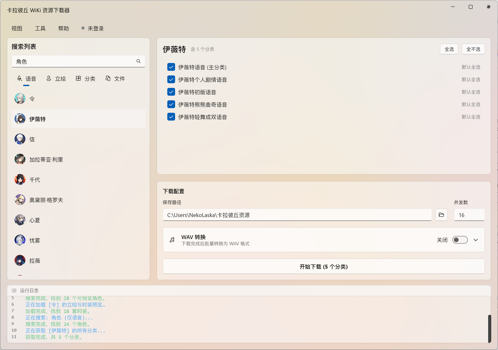
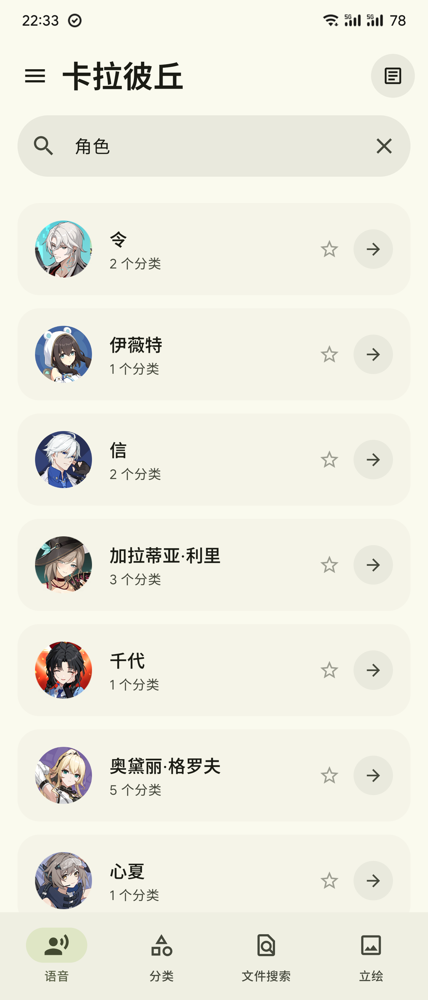

<div align="center">

# 🌌 CalabiYauVoice GUI


[](https://github.com/JetBrains/compose-multiplatform)

[](LICENSE.txt)

基于 Kotlin Multiplatform 构建的[卡拉彼丘](https://wiki.biligame.com/klbq/) Wiki 资源浏览与下载工具，支持桌面端和 Android 端。

[English](README.md)

<br>

<table>
  <tr>
    <th>桌面端</th>
    <th>Android 端</th>
  </tr>
  <tr>
    <td></td>
    <td></td>
  </tr>
</table>

</div>

---

## ✨ 功能特性

### � 共享功能（双端通用）

- **🔍 智能搜索** — 四种搜索模式：仅语音分类、全部分类、文件搜索（命名空间 6）、立绘预览。
- **⚡ 并发下载** — 扫描分类树并并发下载文件，支持自定义并发数。
- **🎵 音频播放** — 支持播放 `WAV`、`OGG`、`FLAC`、`MP3` 格式音频。
- **🖼️ 丰富预览** — 支持 `PNG`、`JPG`、`WebP` 静态图与 `GIF` 逐帧动画预览。
- **🗂️ 文件选择对话框** — 按分类浏览文件，支持搜索、语言筛选（中/日/英）与图片预览。
- **🔍 搜索历史** — 搜索记录持久化展示。

### 🖥️ 桌面端增强（Windows）

- **🔄 MP3/FLAC 转 WAV** — 下载后批量将 `MP3` 或 `FLAC` 转换为 `WAV`，支持自定义采样率与位深，可选合并 WAV。
- **⌨️ 键盘快捷键** — `Ctrl+F` 聚焦搜索，`F5` 重新搜索，`Ctrl+D` 开始下载，`Ctrl+A` / `Ctrl+Shift+A` 全选 / 取消全选，`Ctrl+1~4` 切换模式，`↑↓` 导航列表等。
- **🎛️ 窗口特效** — 运行时动态切换 Mica、Tabbed、Acrylic、Aero 等 Windows 11 背景特效。
- **🪟 自定义标题栏** — 无边框原生窗口，自定义标题栏按钮，支持拖拽移动。
- **🖥️ 兼容性** — 非 Windows 11 设备自动降级，使用渐变背景保证可读性。

### 📱 Android 端增强

- **🏠 Wiki Hub** — 原生 Wiki 客户端，可浏览角色图鉴、武器百科、地图一览、时装筛选、玩法模式、公告资讯、时装投票等，无需 WebView。
- **🖼️ 画廊** — 原生浏览壁纸、表情包、四格漫画，支持分区筛选与全屏预览。
- **🌐 内置 Wiki 浏览器** — 嵌入式 WebView，支持 Cookie 持久化、自动检测登录状态、用户信息展示、文件下载/上传与页面导航。
- **🖼️ 立绘查看器** — 多时装切换，每套时装支持横向滑动浏览全部图片，显示图片类型标签与页码指示器。
- **📁 文件管理器** — 浏览已下载文件，支持多选模式（长按进入）、批量删除/分享、图片画廊预览与音频播放。
- **📊 下载历史** — 记录历史下载，显示状态与文件数。
- **⭐ 收藏功能** — 收藏常用角色，方便快速访问。
- **📶 网络检测** — 离线状态提示横幅，WebView 内置自定义错误页。
- **🎨 Material You** — 支持动态取色与壁纸跟随主题色，亮色/暗色/跟随系统，液态玻璃效果。

---

## 🛠️ 技术栈

### 共享层（commonMain）

| 组件    | 技术                           |
|-------|------------------------------|
| 语言    | Kotlin 2.3.10                |
| 异步    | Kotlin Coroutines            |
| 网络    | OkHttp 5                     |
| 序列化   | kotlinx.serialization        |
| UI 基础 | Compose Multiplatform 1.10.3 |

### 桌面端

| 组件    | 技术                                                                                                                                                |
|-------|---------------------------------------------------------------------------------------------------------------------------------------------------|
| UI 框架 | [Compose Fluent UI](https://github.com/composefluent/compose-fluent-ui)、[ComposeWindowStyler](https://github.com/mayakapps/compose-window-styler) |
| 音频    | `javax.sound.sampled`、`mp3spi`、`jflac-codec`                                                                                                      |
| 图像    | `javax.imageio.ImageIO`（GIF 多帧解码）                                                                                                                 |
| 原生调用  | JNA 5（Windows API）                                                                                                                                |

### Android 端

| 组件    | 技术                           |
|-------|------------------------------|
| UI 框架 | Jetpack Compose + Material 3 |
| 图片加载  | Coil 3（异步加载 + GIF 支持）        |
| 网页    | Android WebView              |
| 音频    | Android MediaPlayer          |
| 架构    | AndroidViewModel + StateFlow |

---

## 📂 项目结构

```text
src/
├── commonMain/          # 共享业务逻辑
│   ├── data/            #   Wiki API 核心、数据模型、序列化
│   ├── portrait/        #   立绘解析与分类组织
│   └── util/            #   文件扩展名工具
├── desktopMain/         # 桌面端（Windows）
│   ├── data/            #   OkHttp 客户端、图片加载器、Cookie 管理
│   ├── viewmodel/       #   状态管理
│   ├── ui/screens/      #   页面组件
│   ├── ui/components/   #   可复用 UI 组件
│   ├── util/            #   音频转换、偏好设置
│   └── jna/windows/     #   Win32 API 绑定
└── androidMain/         # Android 端
    ├── data/            #   OkHttp 客户端、API 客户端、偏好设置
    ├── viewmodel/       #   SearchVM、DownloadVM、PortraitVM
    ├── ui/              #   Compose 页面与组件
    └── MainActivity.kt
```

## 🚀 构建与运行

```powershell
# 构建项目
./gradlew.bat build

# 运行桌面应用
./gradlew.bat run

# 构建 Android APK
./gradlew.bat assembleDebug
```

> macOS / Linux 请使用 `./gradlew` 代替 `./gradlew.bat`。

## ⚠️ 注意事项

- 📡 **API 依赖：** 本应用依赖 Bilibili Wiki 的 API 接口，可用性可能受网络环境影响。
- 📱 **Android：** 需要 Android 8.0（API 26）或更高版本。

## 📄 许可证

详见 [LICENSE.txt](LICENSE.txt)。
